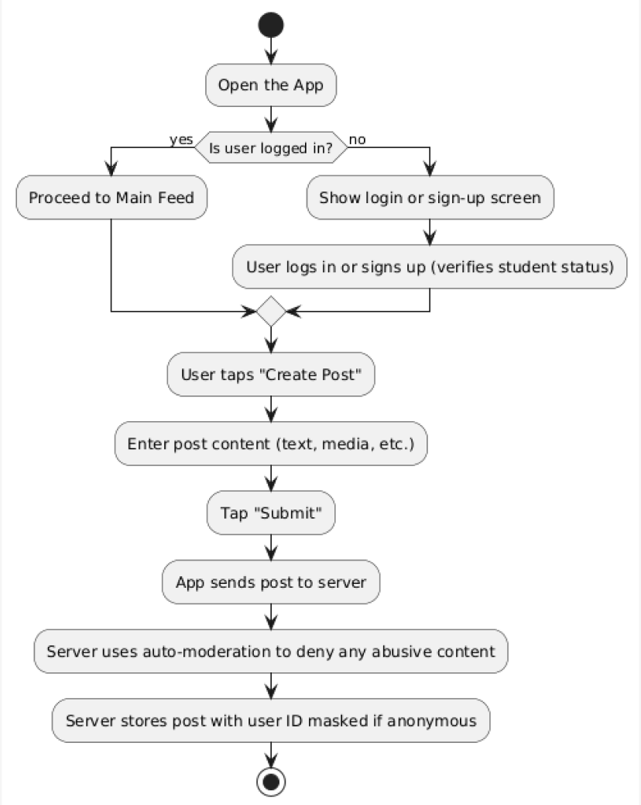
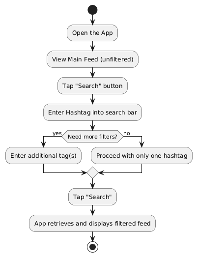

# Specification Phase Exercise

A little exercise to get started with the specification phase of the software development lifecycle. See the [instructions](instructions.md) for more detail.

## Team Members

- Noah Perelmuter  
- Lina Sanchez  
- Siyu Lei  
- Sophia Wang  

## Stakeholders

We interviewed a friend to understand their needs for an anonymous social media app. Here are the goals and frustrations we identified:

### Key Goals/Needs Identified:

- **Express freely and anonymously**: Allowing honest opinions without fear of personal backlash.  
- **Campus-specific filtering**: Easily access content that is directly relevant to the user’s college or courses.  
- **Moderation and safe community**: Implement guidelines and reporting mechanisms to keep discussions constructive and safe.  
- **Interactive engagement**: Enable features like polls, event updates, and community group discussions to foster involvement.  

### Key Problems/Frustrations Identified:

- **Toxicity and trolling**: Anonymity can lead to negative behavior that overwhelms the constructive content.  
- **Lack of focus**: General anonymous apps often mix unrelated content, making it hard to find campus-related discussions.  
- **Navigation difficulties**: Overwhelming noise and poor filtering result in a frustrating user experience.  
- **Security concerns**: The possibility of abuse of anonymity can make users feel unsafe or hesitant to participate.  

## Product Vision Statement

> “Empower college students to share genuine insights and campus-specific experiences on an anonymous, secure, and interactive social platform that fosters community engagement, informed discussions, and safe expression.”

## User Requirements

### User Stories:

1. **As a college student,** I want to post anonymously so that I can share my honest opinions without fear of personal repercussions.  
2. **As a college student,** I want to filter posts by my campus or academic department so that I can focus on content relevant to my immediate community.  
3. **As a college student,** I want an intuitive user interface so that I can easily navigate the app and quickly find what I need.  
4. **As a college student,** I want to participate in campus polls and surveys so that I can contribute to decisions affecting my college community.  
5. **As a college student,** I want the ability to report abusive or harmful content so that I can help maintain a respectful and safe discussion environment.  
6. **As a college student,** I want to follow specific topics or hashtags (e.g., `#DormLife`, `#CampusEvents`) so that I receive updates and discussions that interest me.  
7. **As a college student,** I want to receive notifications about trending discussions on my campus so that I stay informed about important topics and events.  
8. **As a college student,** I want to interact with posts through likes and comments while remaining anonymous so that I can engage without compromising my privacy.  
9. **As a college student,** I want to join or create community groups based on interests or academic courses so that I can have more focused and meaningful discussions.  
10. **As a college student,** I want robust privacy and security measures in the app so that I feel safe sharing my opinions without worry of misuse of my identity.  

## Activity Diagrams

### Activity Diagram #1  
**User Story:** As a college student, I want to post anonymously so that I can share my honest opinions without fear of personal repercussions.  

### Activity Diagram #2  
**User Story:** As a college student, I want to filter posts by my campus or academic department so that I can focus on content relevant to my immediate community.  

## Clickable Prototype

**Link:**  